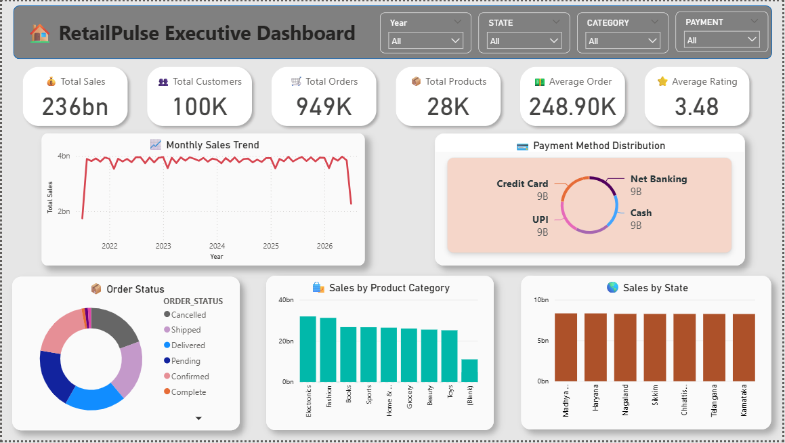
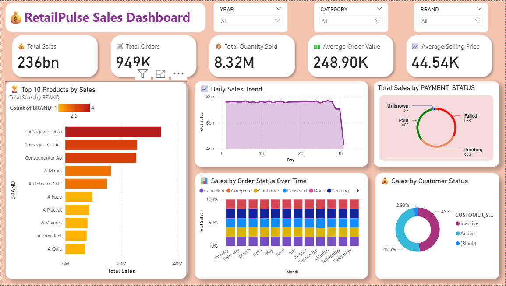
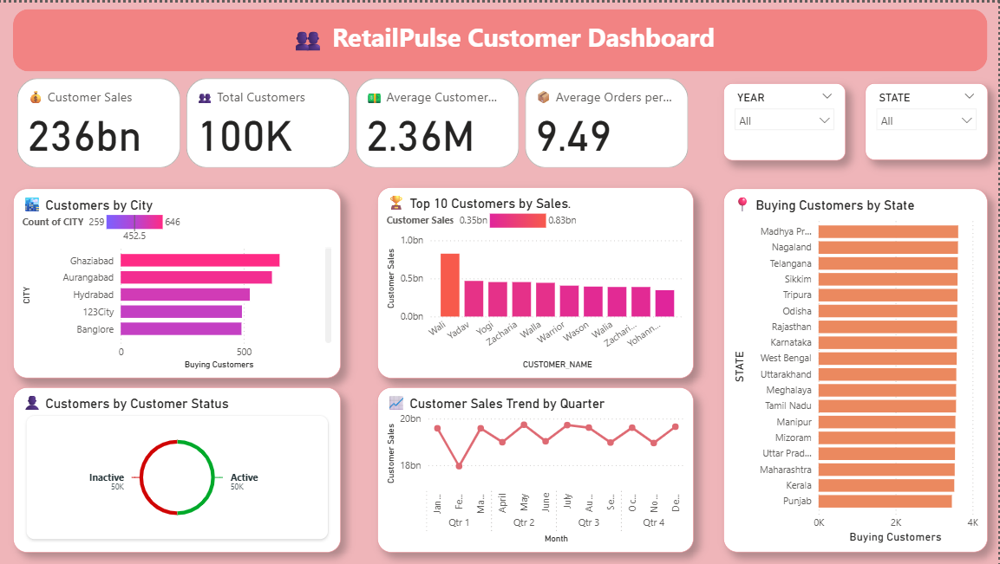
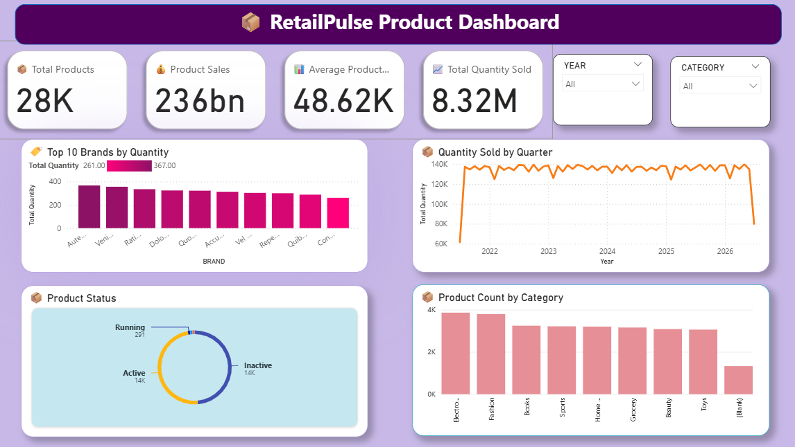
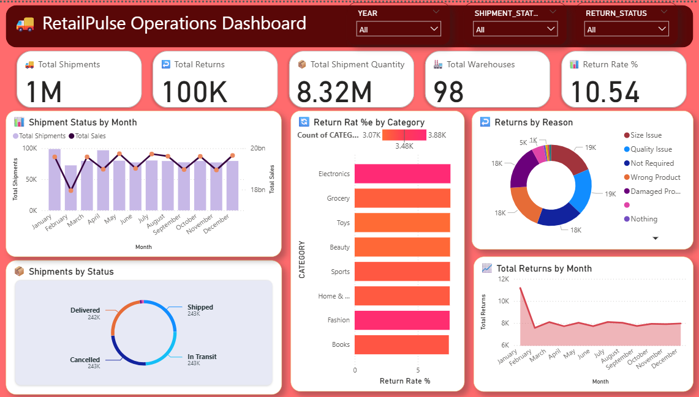

# RetailPulse ETL Data Platform

## End-to-End E-Commerce Data Engineering & Analytics Project

RetailPulse is an end-to-end data engineering and business intelligence project that demonstrates how large-scale e-commerce data can be extracted, transformed, modeled, loaded into a cloud data warehouse, analyzed using SQL, and visualized through interactive Power BI dashboards.

The project processes approximately **6.7 million+ records** across customers, products, orders, payments, shipments, returns, reviews, sellers, and warehouses.

---

## Architecture

The complete data pipeline follows:

**MySQL → Python/Pandas → Databricks/PySpark → Snowflake → Power BI**


### Pipeline Overview

1. **MySQL** — Source e-commerce database
2. **Python & Pandas** — Data extraction
3. **CSV / Parquet** — Raw data storage
4. **Databricks & PySpark** — Data cleaning and transformation
5. **Dimensional Modeling** — Fact and dimension dataset preparation
6. **Snowflake** — Cloud data warehouse
7. **SQL** — Business analysis and analytical views
8. **Power BI** — Interactive dashboards and reporting

---

## Technology Stack

| Layer | Technologies |
|---|---|
| Source Database | MySQL |
| Programming | Python |
| Data Extraction | Python, Pandas |
| Big Data Processing | PySpark |
| Transformation Platform | Databricks |
| File Formats | CSV, Parquet |
| Data Warehouse | Snowflake |
| Data Modeling | Dimensional Modeling |
| Data Analysis | SQL |
| Visualization | Power BI |
| Version Control | Git, GitHub |

---

## Dataset

The source system contains 10 major e-commerce datasets.

| Dataset | Approx. Records |
|---|---:|
| Customers | 100,000 |
| Products | 28,080 |
| Orders | 1,000,000 |
| Order Items | 3,000,000 |
| Payments | 1,000,000 |
| Shipments | 1,000,000 |
| Returns | 100,000 |
| Reviews | 500,000 |
| Sellers | 535 |
| Warehouses | 100 |

**Total: approximately 6.7M+ records**

---

## ETL Pipeline


### 1. Source Data — MySQL

The project starts with a relational MySQL source database containing e-commerce operational data.

SQL scripts are included for source table creation and validation.

### 2. Data Extraction — Python

Python extraction scripts connect to MySQL and extract the source datasets.

The extracted data is stored in:

- CSV
- Parquet

Individual extraction scripts are available for customers, products, orders, order items, payments, shipments, returns, reviews, sellers, and warehouses.

### 3. Data Transformation — Databricks & PySpark

PySpark is used to process and clean the extracted datasets in Databricks.

Transformation operations include:

- Duplicate removal
- NULL validation
- String trimming
- Text standardization
- Hidden-character removal
- Date standardization
- Invalid-value handling
- Data-type validation
- Business-rule validation

The cleaned datasets are written in Parquet format.

### 4. Data Warehouse Modeling

The transformed data is organized into dimension and fact datasets before loading into Snowflake.

The warehouse contains:

**Dimensions**

- DIM_CUSTOMER
- DIM_PRODUCT
- DIM_SELLER
- DIM_WAREHOUSE
- DIM_DATE

**Facts**

- FACT_SALES
- FACT_PAYMENTS
- FACT_SHIPMENTS
- FACT_RETURNS
- FACT_REVIEWS

---

## Data Model


### Dimension Tables

| Table | Description |
|---|---|
| DIM_CUSTOMER | Customer demographic and registration information |
| DIM_PRODUCT | Product, category, brand, price and inventory information |
| DIM_SELLER | Seller information and ratings |
| DIM_WAREHOUSE | Warehouse location and capacity information |
| DIM_DATE | Calendar attributes for time-based analysis |

### Fact Tables

| Table | Description |
|---|---|
| FACT_SALES | Order-item-level sales transactions |
| FACT_PAYMENTS | Payment transactions and statuses |
| FACT_SHIPMENTS | Shipment and delivery information |
| FACT_RETURNS | Returns and refund information |
| FACT_REVIEWS | Customer product reviews and ratings |

---

## Snowflake Data Warehouse

Snowflake is used as the analytical warehouse for the transformed e-commerce data.

The `snowflake/` directory contains:

```text
snowflake/
├── dimensions/
├── facts/
├── views/
├── validation/
└── business_queries/
```

### Analytical Views

The project contains the following Snowflake views:

- `VW_CUSTOMER_SALES`
- `VW_EXECUTIVE_DASHBOARD`
- `VW_PAYMENT_ANALYSIS`
- `VW_PRODUCT_SALES`
- `VW_RETURN_ANALYSIS`
- `VW_REVIEW_ANALYSIS`
- `VW_SALES_ANALYSIS`
- `VW_SHIPMENT_ANALYSIS`

### Business Analysis

SQL business analysis covers areas such as:

- Revenue and sales performance
- Monthly sales trends
- Customer purchasing behavior
- Product and category performance
- Payment analysis
- Shipment performance
- Warehouse operations
- Return and refund analysis
- Customer reviews and ratings

---

## Power BI Dashboards

The final analytical layer was developed using Power BI.

The report contains five dashboard pages.

### Executive Dashboard

Provides a high-level overview of business performance and major KPIs.



### Sales Dashboard

Analyzes revenue, orders, sales trends, and other sales performance metrics.



### Customer Dashboard

Analyzes customer behavior, purchasing activity, and customer-level performance.



### Product Dashboard

Provides insights into products, categories, brands, ratings, and product performance.



### Operations Dashboard

Analyzes operational areas including shipments, warehouses, deliveries, and returns.



---

## Project Structure

```text
RetailPulse-ETL-Data_Platform/
│
├── config/
│   ├── db_connection.py
│   ├── snowflake_config.py
│   ├── settings.py
│   ├── logger.py
│   └── error_handler.py
│
├── data/
│   ├── raw/
│   ├── Transformed/
│   └── warehouse/
│
├── databricks/
│   ├── transformations/
│   ├── dimensions/
│   └── facts/
│
├── documentation/
│   ├── Architecture.md
│   ├── Data_Model.md
│   └── Setup_Guide.md
│
├── mysql/
│   ├── create_tables.sql
│   └── validation_queries.sql
│
├── powerbi/
│   └── RetailPulse_PowerBI_Dashboard.pbix
│
├── python/
│   ├── extraction scripts
│   ├── Snowflake loading scripts
│   └── run_pipeline.py
│
├── screenshots/
│   ├── architecture_diagram.png
│   ├── etl_flow_diagram.png
│   ├── data_model_diagram.png
│   └── dashboard screenshots
│
├── snowflake/
│   ├── dimensions/
│   ├── facts/
│   ├── views/
│   ├── validation/
│   └── business_queries/
│
├── .gitignore
├── LICENSE
├── requirements.txt
└── README.md
```

---

## Key Data Engineering Features

- Built an end-to-end ETL pipeline across multiple technologies
- Processed approximately **6.7M+ e-commerce records**
- Extracted MySQL data using Python and Pandas
- Used Parquet for efficient intermediate data storage
- Performed distributed transformations using PySpark and Databricks
- Implemented data cleaning and quality checks
- Built dimension and fact datasets
- Loaded transformed data into Snowflake
- Developed reusable SQL analytical views
- Performed business analysis using SQL
- Created interactive Power BI dashboards
- Implemented logging and error-handling components
- Organized the project using modular scripts and version control

---

## Data Quality

Data-quality operations performed during the pipeline include:

- Duplicate detection and removal
- NULL-value validation
- Invalid-value detection
- Hidden-character removal
- String standardization
- Date validation
- Status validation
- Data-type validation
- Relationship checks
- Record-count validation

---

## Running the Project

Detailed environment configuration and setup instructions are available in:

`documentation/Setup_Guide.md`

### Install Dependencies

```bash
pip install -r requirements.txt
```

### Environment Variables

Database credentials are stored locally using a `.env` file.

The `.env` file is excluded from version control to prevent credentials from being exposed.

### Run Pipeline

```bash
python python/run_pipeline.py
```

---

## Project Documentation

Additional documentation:

- [Architecture](documentation/Architecture.md)
- [Data Model](documentation/Data_Model.md)
- [Setup Guide](documentation/Setup_Guide.md)

---

## Dashboard File

The Power BI report is located at:

```text
powerbi/RetailPulse_PowerBI_Dashboard.pbix
```

---

## Project Highlights

**6.7M+ Records | MySQL | Python | Pandas | PySpark | Databricks | Snowflake | SQL | Power BI**

This project demonstrates an end-to-end data engineering workflow, from raw transactional data through distributed transformation and cloud warehousing to business intelligence and analytical reporting.

---

## Author

**Mahesh Banala**

Data Analytics & Data Engineering Portfolio Project