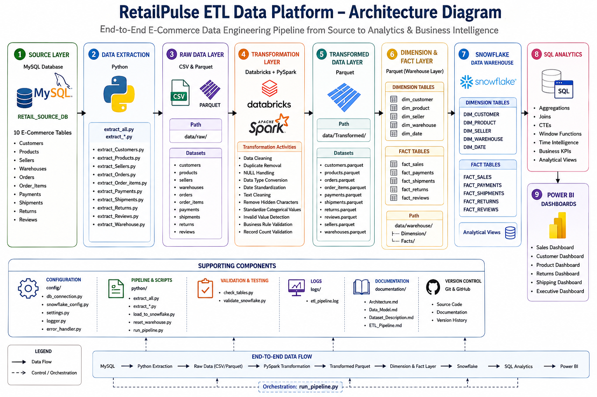
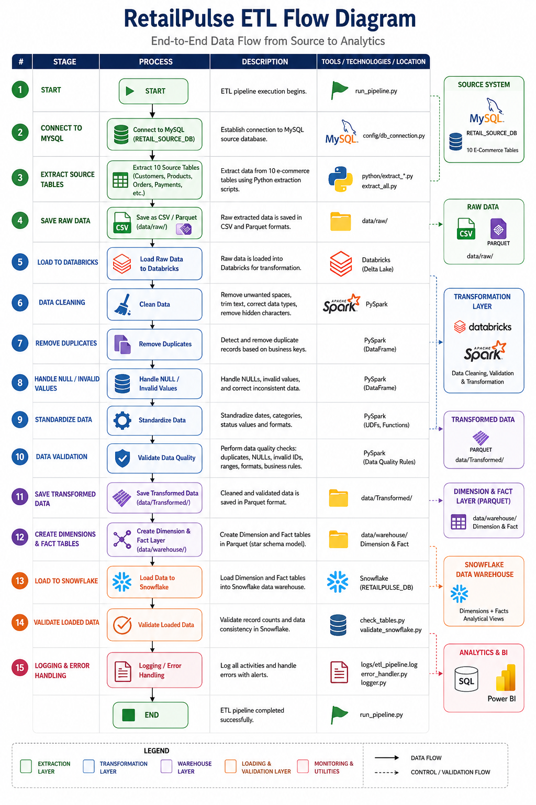

# RetailPulse ETL Data Platform - Architecture

## Overview

RetailPulse is an end-to-end e-commerce data engineering and analytics project designed to process large-scale transactional data from source systems to business intelligence dashboards.

The platform follows the pipeline:

MySQL → Python/Pandas → Databricks/PySpark → Snowflake → Power BI

## Architecture Components

### 1. MySQL - Source Database

MySQL acts as the source system containing the raw e-commerce datasets.

Source tables include:

- Customers
- Products
- Sellers
- Warehouses
- Orders
- Order Items
- Payments
- Shipments
- Returns
- Reviews

The source database contains approximately 6.7 million records.

### 2. Python - Data Extraction

Python and Pandas are used to extract data from MySQL.

The extraction layer:

- Connects securely to MySQL
- Extracts source tables
- Exports datasets to CSV and Parquet
- Provides reusable extraction scripts

### 3. Databricks & PySpark - Data Transformation

Databricks is used as the distributed data-processing environment.

PySpark transformations include:

- Duplicate removal
- NULL validation
- Text trimming and standardization
- Hidden-character removal
- Date standardization
- Invalid-value handling
- Business-rule validation
- Preparation of dimension and fact datasets

Transformed datasets are stored in Parquet format.

### 4. Snowflake - Data Warehouse

Cleaned datasets are loaded into Snowflake and organized using dimensional modeling.

The warehouse contains:

**Dimension Tables**
- DIM_CUSTOMER
- DIM_PRODUCT
- DIM_SELLER
- DIM_WAREHOUSE
- DIM_DATE

**Fact Tables**
- FACT_SALES
- FACT_PAYMENTS
- FACT_SHIPMENTS
- FACT_RETURNS
- FACT_REVIEWS

Snowflake analytical views and business SQL queries are used to support reporting and analysis.

### 5. Power BI - Analytics & Reporting

Power BI connects the warehouse data to interactive business dashboards.

The report contains five dashboard pages:

1. Executive Dashboard
2. Sales Dashboard
3. Customer Dashboard
4. Product Dashboard
5. Operations Dashboard

These dashboards provide insights into sales, customers, products, payments, shipments, returns, reviews, and operational performance.

## Architecture Diagram

## ETL Flow

