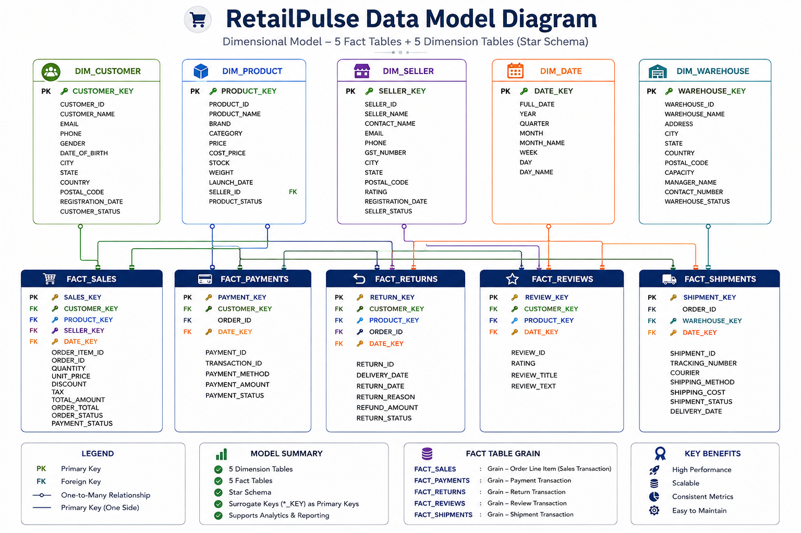

# RetailPulse Data Model

## Overview

RetailPulse uses a dimensional data model designed for analytical querying and Power BI reporting.

The warehouse consists of five dimension tables and five fact tables.

## Dimension Tables

### DIM_CUSTOMER
Stores customer information used for customer and sales analysis.

Primary Key: CUSTOMER_ID

### DIM_PRODUCT
Stores product information including product, brand, category, pricing, stock, and seller information.

Primary Key: PRODUCT_ID

Foreign Key: SELLER_ID → DIM_SELLER

### DIM_SELLER
Stores seller information and seller performance attributes.

Primary Key: SELLER_ID

### DIM_WAREHOUSE
Stores warehouse information used for shipment and operational analysis.

Primary Key: WAREHOUSE_ID

### DIM_DATE
Provides calendar attributes for time-based analysis.

Primary Key: DATE_KEY

## Fact Tables

### FACT_SALES
Stores order-item-level sales transactions.

Primary Key: ORDER_ITEM_ID

Relationships:
- CUSTOMER_ID → DIM_CUSTOMER
- PRODUCT_ID → DIM_PRODUCT

### FACT_PAYMENTS
Stores payment transactions and payment status information.

Primary Key: PAYMENT_ID

### FACT_SHIPMENTS
Stores shipment, courier, warehouse, and delivery information.

Primary Key: SHIPMENT_ID

Relationship:
- WAREHOUSE_ID → DIM_WAREHOUSE

### FACT_RETURNS
Stores product return and refund information.

Primary Key: RETURN_ID

### FACT_REVIEWS
Stores customer product reviews and ratings.

Primary Key: REVIEW_ID

Relationships:
- CUSTOMER_ID → DIM_CUSTOMER
- PRODUCT_ID → DIM_PRODUCT

## Data Model Diagram

